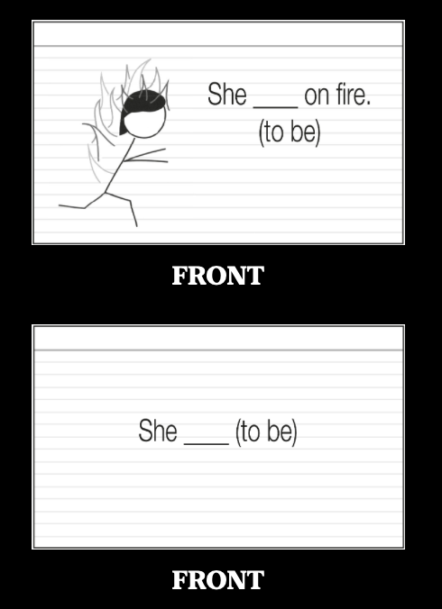

# Chapter 3: Sound Play

It's important to master the sounds to avoid instilling bad habits and disconnects between written and spoken language (broken words).
There are several trainings that we need to do: ear (listening), mouth (speaking) and eye (connecting written and spoken).

## Ear Training
- surreptitiously, panache
- As babies, we gradually lose the ability to discern between the hundreds of variations between sounds. In an American household, babies frequently hear "r" and "l" sounds from the two extremes of the spectrum and not a lot in the middle. In a Japanese household, babies hear sounds from the middle.
- Practice minimal pairs with feedback.
- Why? We are in sync with native speakers when they talk, we can learn words faster, we remember words more easily.
- Our ears become more sensitive to sound changes and can pick up sound rules more easily.

## Mouth Training
- A good accent is the "ultimate gesture of empathy".
- Work on the accent early to avoid bad pronunciation habits. Each new word will enforce the good habits.
- Use the IPA. It includes the sound and "set of instructions" on how to make the sound (tongue, lips, vocal cords).
- Backchaining: start from the back and at one letter at a time.

## Eye Training
- Different languages have different correspondence between their written and spoken language. We need to internalize them with SRS.
- We need to see what we're hearing.
- Combo of recording and IPA -> IPA
- By learning more and making the connections, we work less. Balance with relevance (learn what is useful).

# Chapter 4: Word Play

What is the most effective way to learn words?

## Frequency List
- Words consist of grammar, sound, spelling, meaning, and connected words.
- We need to hear the *symphony* of those components to form our word, translation does not allow for that.
- Diminishing returns, the more words we know:
    - 1000 words -> 75% comprehension, 2000 -> 80%, 5500 words -> 90%, 12500 words -> 95%
- First, learn the first 100 words on the 625 word frequency list.
- Then, employ the Island building exercise:
    - Choose a topic that you like.
    - Learn a bunch of sentences pertaining to that specific topic (stones).
    - Build the islands of stones.
    - This creates fluency within one narrow topic and introduces you to function words/grammar for other topics. It also makes a personal connection and keeps you engaged.
    - Create 50-100 cards, with each one having only 2-3 new pieces of information.
- Finally, finish the rest of the 525 words.

## Word Games
- There are two strategies/games we can use to remember words:
    - Spot the difference with Google images (builds personal connection)
    - Connect the word to a personal memory

## Grammar
- Grammatical gender is a prominent feature of the Proto-Indo European derived languages.
- Mnemoic Imagery - each gender is associated with a certain "action"
- It can also be used for spelling e.g. what does a word start with?

## Personal connection
- We also want to make a personal connection:
    - concrete nouns: when was the first/last time I saw _?
    - abstract noun: how has the _ affected me?
    - adjectives: am I _? Do I know someone that is _?, what do I own that is _?
    - verbs: do I like to _? Do I know someone that likes to _?

# Chapter 5: Sentence Play

> First you learn the instrument, then you learn the music, then you forget all that shit and just play.

- Humans have a "language machine" that is always on through comprehensible input.
- Children and adults learn grammar in predictable stages e.g. 'go' and then 'going'
- The development stages for grammar, especially in speech since it's so spontaneous, is the same for children and adults.
- We cannot expect to learn a grammar rule and instinctively employ it in our speech.
- How it works is learn the grammar rules and we find sentences and translate them (get a gist).
- We use this to *understand* the sentence which feeds into the language machine that develops naturally.
- "Learn a language faster by learning the rules"
- Grammar drill can be comprehensible input but not interesting enough to remember

## In practice
- When we read through the sentences, we make flashcards for
    - new words
    - new word forms
    - new word order

- For new grammar forms (e.g. declension charts), we can create our own sentences.

- Pick a Thing technique using mnemonics to remember:
    - Don't pick anything until a problem.
    - Pick a thing (arbitrary, associated with the first word, associated with the abstract concept)
    - Insert that thing into the stories of the flash card
    - Do this not when making the card, but immediately after we get it wrong
- Self-directed writing for output and ask for corrections
- If there is a difficult word to understand, then skip it