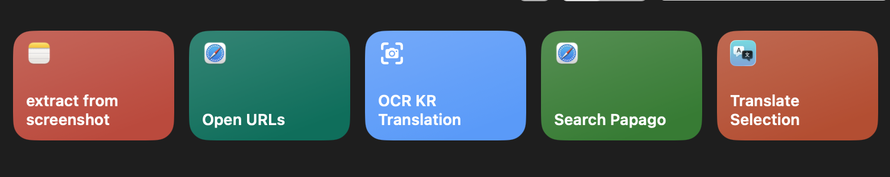
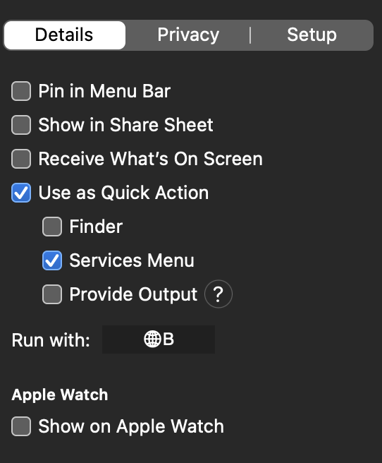
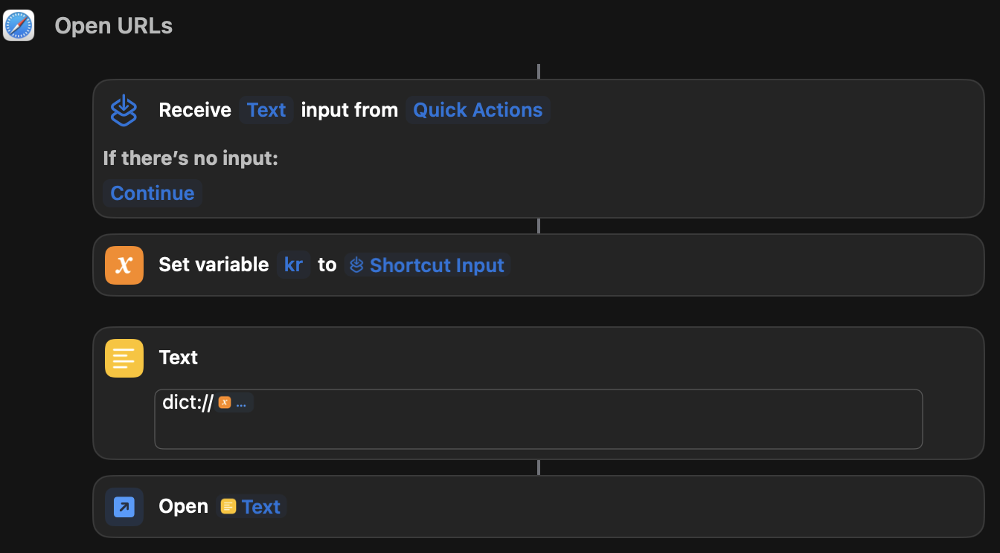
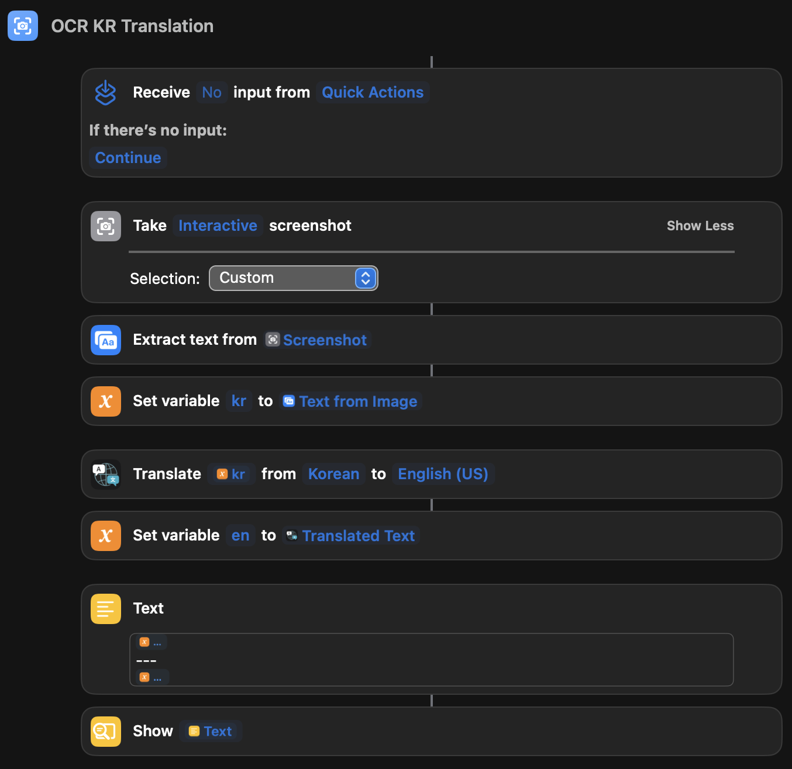
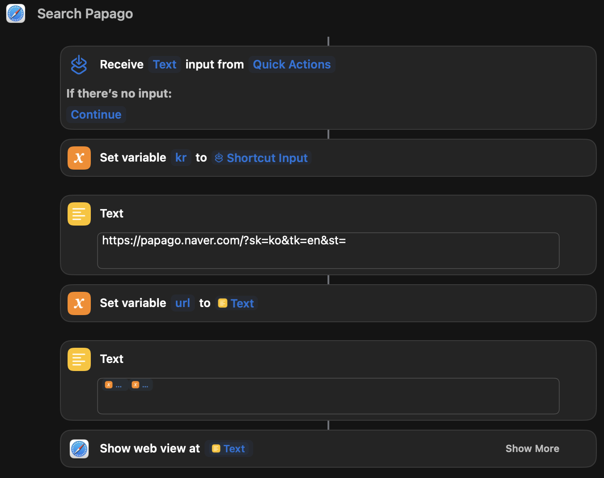
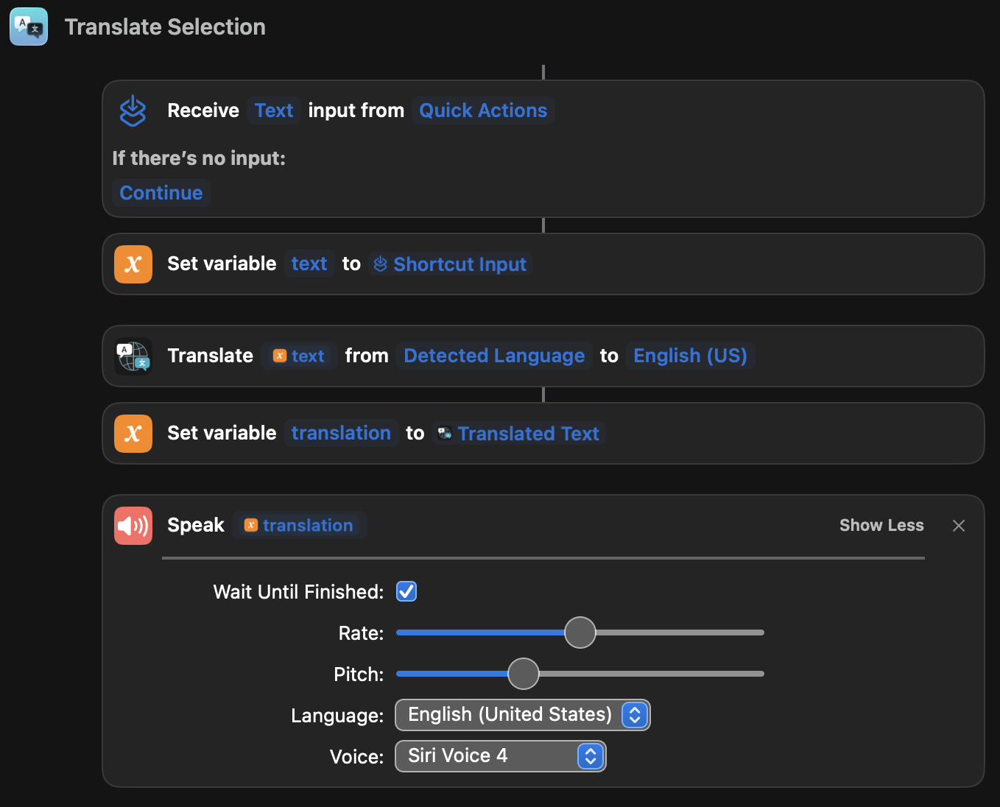

On a random night, I decided to play around with Apple Shortcuts and make a few ones for learning Korean.

To activate these Shortcuts, you can put a keyboard command under Quick Actions

# Open URLs

- `dict://<word>` opens the Dictionary app

# OCR KR Translation

# Search Papago

- Using **Text** to append `url` with the `kr` variable

# Translate Selection

